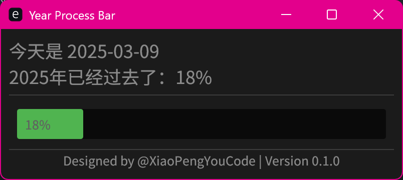

# Year Process Bar

This project is a simple year progress bar that visually represents the percentage of the year that has passed.



## Features

- Displays the current date and time.
- Shows a progress bar indicating the percentage of the year completed.
- Updates in real-time.

## Installation

1. Clone the repository:
    ```sh
    git clone https://github.com/yourusername/year_process_bar.git
    ```
2. Navigate to the project directory:
    ```sh
    cd year_process_bar
    ```
3. Run:
    ```sh
    cargo run
    ```

## Contributing

Contributions are welcome! Please open an issue or submit a pull request for any changes.

## License

This project is licensed under the MIT License. See the [LICENSE](LICENSE) file for details.
